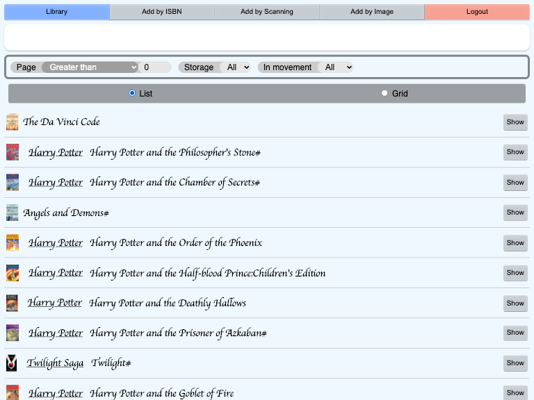
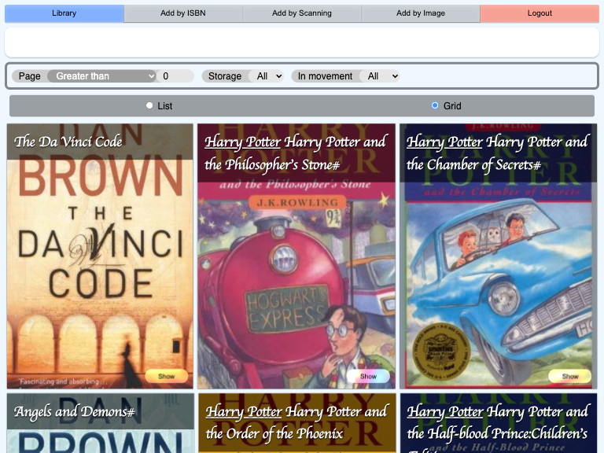
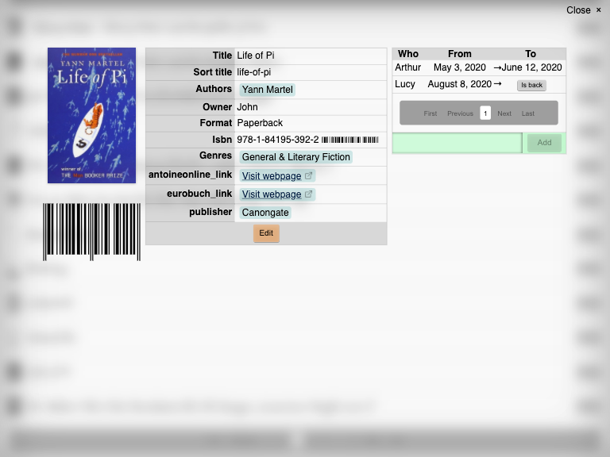
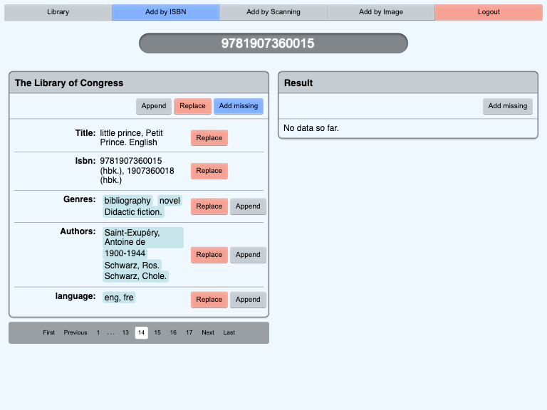
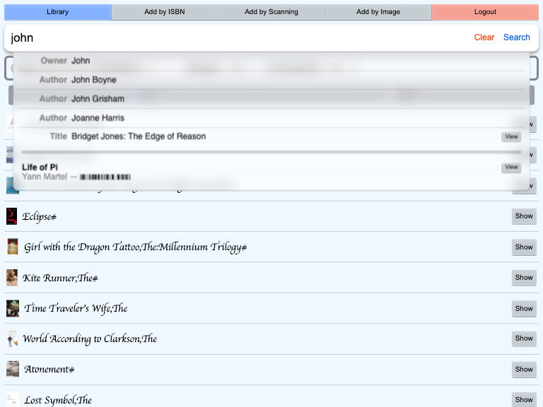

# Livres

## What is _Livres_?

_Livres_ is a small web application to keep track of the books you have.

## What it can do?

_Livres_ act as a library: you can add books to it, search them, and keep track to whom you lend your books.

To add a book to the application you have 3 ways:
 - By entering its ISBN code
 - By taking a photo of the book ISBN
 - By live scanning the ISBN code with a webcam (or your phone camera)

After that, the application will search for additional information about the book from its ISBN.

Currently the application search additional information into [20 differents providers](https://github.com/MacFJA/BookRetriever/blob/master/Providers.md)

## Screenshots

([Also in dark mode](doc/DarkMode.md))

## Installation

You can download a pre-build release (available in the release section of GitHub) or build it from the source by downloading (on cloning the git repository) and by run the command `make build`.

There are multiple environment settings, please read the documentation on [how to setup you production environment](doc/Environment/README.md).

### Local / Development installation

The whole process is explain [in this document](doc/DEV.md).

But to put it simply, it's just a matter of two commands, `make app`and `make run`.

## Contributing

Contributions are welcome. Please open up an issue or create PR if you would like to help out.

Read more in the [Contributing file](CONTRIBUTING.md)

## License

The MIT License (MIT). Please see [License File](LICENSE.md) for more information.