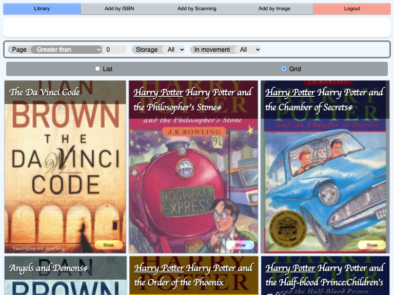
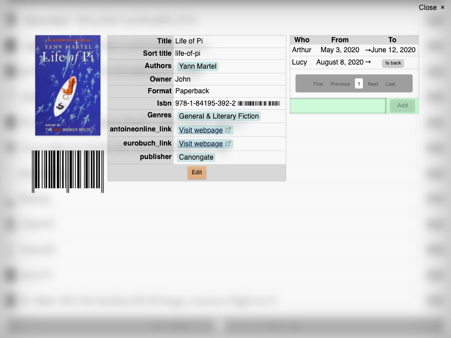
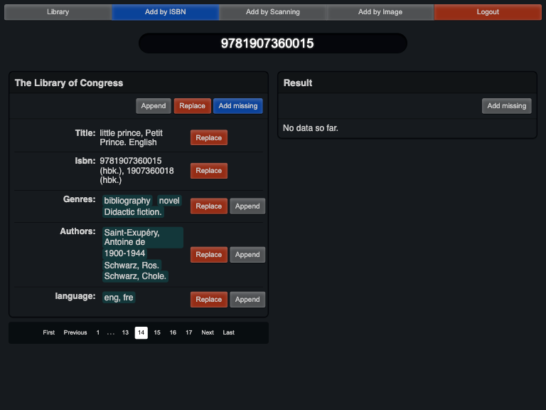

# Dark Mode

_Livres_ came with 2 theme, light theme and dark theme.

The selection of theme is automatic, based on your browser [preferred color scheme](https://developer.mozilla.org/en-US/docs/Web/CSS/@media/prefers-color-scheme), which is normally set accordling to [your OS choice](https://web.dev/prefers-color-scheme/#activating-dark-mode-in-the-operating-system).

The default theme is teh light one, which mean, this your browser don't support color scheme, it will the used theme.

## Light theme

## Dark theme

