# Build production environment

## RediSearch

```puml
@startuml
digraph G {
    rankdir=LR

    symfony [label="Symfony", shape=oval]
    redis [label="RediSearch", fillcolor=lightblue, style=filled, shape=box3d]

    symfony -> redis
}
@enduml
```



### Installation

#### Alpine

```shell script
sudo apk add redis
```

Then you will have to build the RediSearch module ([see official documentation](https://oss.redislabs.com/redisearch/))

#### Debian

```shell script
sudo apt install redis-redisearch
```

#### CentOS

```shell script
sudo yum install redis
```

Then you will have to build the RediSearch module ([see official documentation](https://oss.redislabs.com/redisearch/))

### Configuration

You have to enable the Redis module.

Configuration should be at `/etc/redis/redis.conf`

The module should be at `/usr/lib/redis/modules/redisearch.so`

### Symfony configuration

You need to tell symfony where to find the database.
You have two options: use Environment variable, use `dotenv` file.

#### Environment variable

Edit your HTTP server configuration to add environment variable
```ini
REDISEARCH_URL=redis+predis://redis_password@127.0.0.1:6379/0
# REDISEARCH_URL=redis://127.0.0.1/3
```

#### Dotenv configuration

At the project root create/edit the file `.env.local` and add the following line:
```ini
REDISEARCH_URL=redis+predis://redis_password@127.0.0.1:6379/0
# REDISEARCH_URL=redis://127.0.0.1/3
```
